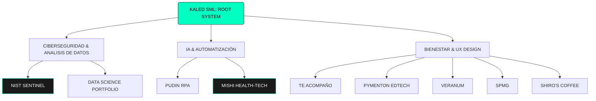

# 🌌 Kaled SML | Cyber-Zen Core v2.0

> **Computer Engineer 💻 | Cybersecurity & IT Audit 🛡️ | R+D+i 🚀 | Digital Marketing & UX Designer 🎨 | KaledSML ✨🐯**

---

## 🧬 Mapa de Nodos (Ecosistema de Proyectos)

---

## 🛠️ Data Logs: Proyectos Críticos [Nodos 001-009]

### 🛡️ [NIST_SENTINEL] | Compliance Orchestrator
**Orquestador de Cumplimiento Normativo para Auditorías IT.**
* **Core:** Arquitectura Serverless de Conocimiento Cero (Zero-Knowledge).
* **Impacto:** Transforma auditorías estáticas NIST CSF 2.0 en flujos dinámicos tipo Kanban, asegurando que los datos sensibles nunca abandonen el LocalStorage del auditor.
* **Stack:** Ciberseguridad, JS Vanilla, Marco NIST 2.0.

### 🐈 [PUDIN_GHOST_CAT] | Agente RPA Autónomo
**Sistema de Monitoreo de Bienestar Laboral.**
* **Core:** Máquinas de Estado Finitas (FSM) para monitoreo de actividad en Windows.
* **Impacto:** Ejecuta "maldades" programadas para forzar descansos, mitigando el agotamiento tecnológico mediante automatización con Win32API.
* **Stack:** Python, Win32API, FSM.

### 🐾 [MISHI_HEALTHTECH] | AI & Ethical Gamification
**Ingeniería de Software Aplicada a la Salud Mental.**
* **Core:** IA (NLP) para escucha activa y motor de gamificación basado en químicos DOSE.
* **Impacto:** Sistema validado bajo ISO/IEC 25010 que incluye protocolos de Primeros Auxilios Psicológicos (PAP) y anclaje sensorial.
* **Stack:** NLP, Octalysis, IEEE 830.

### 🤝 [TE_ACOMPAÑO] | Seguridad Híbrida Offline
**Innovación en Seguridad de Género sin Cobertura de Red.**
* **Reconocimiento:** 3er Lugar en Categoría Innovación (Rally Latinoamericano 2021).
* **Impacto:** Bocetos de bajo nivel sobre la utilización de protocolos Mesh (Bluetooth/Wi-Fi Direct) para crear redes de seguridad local en zonas aisladas.

### 📊 [DATA_SCIENCE_PORTFOLIO] | Analytics Core
**Análisis Predictivo y Arquitectura de Datos.**
* **Resultados:** Modelos con 93.6% de precisión en predicción solar y 89% en potabilidad de agua.
* **Impacto:** Diseño de bases de datos relacionales con SAP PowerDesigner y SQL Server para trazabilidad logística.

---

## 📜 Timeline de Especialización & Impacto [STORY_LOG]

### 🎓 Formación Base
**Ingeniera Informática & Licenciada en Ciencias de la Ingeniería** > *Titulada con **Distinción Unánime** en Licenciatura (Escala 6.0 - 7.0).*

---
#### 🚀 2026 | Nuevo año
* **Proyecto:** Pudin RPA.
* **Proyecto:** Nist Sentinel.

#### 🚀 2024 - 2025 | Consolidación Técnica & IA
* **Gestión Estratégica:** Diplomado en Marketing Digital y Gestión Estratégica (AIEP/Movistar/Sence).
* **IA & Cloud:** Certificada en Google AI Essentials, Google Prompting Essentials y Azure AI Fundamentals (AI-900).
* **Ciberseguridad:** Formación en Microsoft SC-900 (WOMCY) y Ethical Hacking (Hacker Mentor).
* **Dominio Técnico:** Especializaciones Cisco en Operating Systems, Network Support, Data Science y Hardware Basics.

#### 🚀 2023 | Inmersión en Ciberseguridad
* **Especialización Cisco:** Certificado de finalización en Introduction to Cybersecurity, iniciando mi especialización formal en protección de datos.

#### 🚀 2022 | Internacionalización & Innovación (Proyecto Mishi)
* **Finalista Internacional AUF:** Seleccionada entre los 10 mejores proyectos del mundo.
* **1er Lugar NTT DATA & UBO:** Premio a la visión evolutiva de IA aplicada a la salud.
* **Reconocimientos I+D:** 2do Lugar Festival del Pitch e Innovación en Salud Mental (UBO).
* **Practicante en audit Staff and Compliance en Enel Chile:** Ejecución de auditorías técnicas bajo marcos de referencia internacionales como ISO 27001, ISO 27002, NIST y NERC-CIP. Durante este periodo, realicé el análisis y seguimiento de vulnerabilidades técnicas, la revisión de controles de Ciberseguridad (IT Baseline) y la evaluación de cumplimiento de la Ley de Protección de Datos Personales. Mi gestión incluyó la auditoría de controles para la prevención de delitos informáticos y el apoyo en la gestión de denuncias éticas de TI, obteniendo una calificación máxima (7.0) por mi proactividad y capacidad para agilizar procesos críticos en infraestructuras de energía.

#### 🚀 2021 | Liderazgo & Agilidad
* **Metodologías Ágiles:** Certificación Scrum Foundation Professional Certification (SFPC™).
* **Ciberseguridad:** Implementación de marcos NIST e ISO 27001 (Capacitación con Seguridad Cero).
* **Hitos de Innovación:** 1er Lugar Proyecto "Acusete" (IoT) y 3er Lugar Rally Latinoamericano de Innovación.
* **Contribución Académica:** Colaboración técnica en Proyecto PUCASO y 3er Lugar en Concurso Fotográfico.

---
